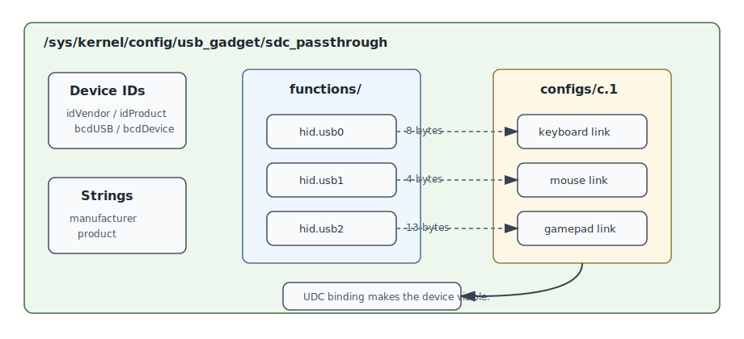

# Architecture

This tool is a Linux input proxy. It reads physical input devices from the local machine and presents the local machine itself to a connected USB host as a composite USB HID device.


The intended runtime path is:

```text
physical keyboard / mouse / controller
        |
        v
/dev/input/event* through evdev
        |
        v
forwarding thread
        |
        v
/dev/hidg0 keyboard
/dev/hidg1 mouse
/dev/hidg2 Xbox-style HID gamepad
        |
        v
USB gadget/device-mode port
        |
        v
connected host computer
```

The GTK window is only a control and status surface. It starts and stops the forwarding thread and shows the currently grabbed devices. It is not in the input forwarding hot path.

## Main Components

`main.cpp` contains the Linux runtime plumbing:

- creates the ConfigFS USB gadget
- configures HID functions for keyboard, mouse, and controller
- opens `/dev/hidg*` output endpoints
- scans `/dev/input/event*`
- classifies input devices
- grabs selected devices with `EVIOCGRAB`
- forwards input events to USB HID reports

`include/input_translation.hpp` and `src/input_translation.cpp` contain portable translation logic:

- evdev key code to USB HID keyboard usage
- keyboard modifier bit positions
- Xbox-style gamepad button and axis mapping
- absolute axis normalization
- Xbox-style controller report packing

`tests/input_translation_tests.cpp` validates the portable translation logic without needing Linux gadget hardware.

## USB Gadget Model

The app creates this gadget:



```text
/sys/kernel/config/usb_gadget/sdc_passthrough
```

It defines one configuration with three HID functions:

```text
hid.usb0 -> keyboard, 8-byte boot keyboard report
hid.usb1 -> mouse, 4-byte relative mouse report
hid.usb2 -> Xbox-style HID gamepad, 13-byte report
```

Each function receives a HID report descriptor and a report length. When the kernel exposes the optional `interval` ConfigFS attribute, the app writes `1` to request a 1 ms interrupt polling interval.

Finally the app binds the gadget by writing a USB device controller name from `/sys/class/udc` into:

```text
/sys/kernel/config/usb_gadget/sdc_passthrough/UDC
```

If `/sys/class/udc` is empty, the hardware or running kernel does not expose a USB device controller and this design cannot present USB devices to another host.

## Input Device Handling

The app scans `/dev/input` for `event*` nodes. For each readable node it checks the evdev capability bits:

- relative X/Y motion means mouse
- absolute axes plus gamepad buttons means controller
- key events with normal keyboard keys means keyboard

Accepted devices are opened nonblocking and grabbed with:

```text
EVIOCGRAB
```

This prevents the local Wayland/Steam session from also consuming those same physical events. The emergency chord `Ctrl+Shift+Esc` is handled locally by the forwarding loop and stops capture.

## Stop Flow

On stop, the app:

1. sends neutral reports to release keys/buttons/axes
2. releases every `EVIOCGRAB`
3. closes input and HID gadget file descriptors
4. unbinds the USB gadget by clearing `UDC`
5. updates the GTK status

This leaves the target host without the emulated USB devices until capture is started again.
