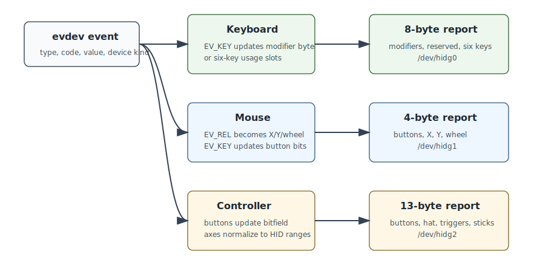

# Input Translation

The forwarding code converts Linux evdev events into USB HID reports. The mapping is intentionally direct: what comes in from the physical device is reflected to the host with the closest matching HID field.



## Keyboard

Linux keyboard events arrive as:

```text
EV_KEY code value
```

The value means:

```text
0 -> released
1 -> pressed
2 -> repeat
```

The current code ignores repeat events because USB HID keyboard reports represent key state, not repeated text. Repeats are normally generated by the connected host.

The keyboard endpoint uses an 8-byte boot keyboard report:

```text
byte 0: modifier bits
byte 1: reserved
byte 2: key slot 1
byte 3: key slot 2
byte 4: key slot 3
byte 5: key slot 4
byte 6: key slot 5
byte 7: key slot 6
```

Modifier mapping:

```text
bit 0 -> left control
bit 1 -> left shift
bit 2 -> left alt
bit 3 -> left meta
bit 4 -> right control
bit 5 -> right shift
bit 6 -> right alt
bit 7 -> right meta
```

Non-modifier keys are converted from evdev key codes to USB HID keyboard usages. This is done with explicit mappings, not arithmetic over Linux key codes, because evdev letter codes are not alphabetically contiguous.

## Mouse

The mouse endpoint uses a 4-byte relative mouse report:

```text
byte 0: button bits
byte 1: relative X
byte 2: relative Y
byte 3: wheel
```

Button mapping:

```text
bit 0 -> left
bit 1 -> right
bit 2 -> middle
bit 3 -> side
bit 4 -> extra
```

Relative movement and wheel deltas are clamped into the signed 8-bit HID range:

```text
-127..127
```

Wayland pointer position is not used. The app forwards device-level relative motion from evdev, which is why this works independently of the compositor.

## Xbox-Style HID Controller

The controller endpoint is an Xbox-style HID gamepad. It is not a true Xbox 360/XInput USB device.

The report length is 13 bytes:

```text
byte 0: buttons low byte
byte 1: buttons high byte
byte 2: D-pad hat, 0..7 direction, 8 neutral
byte 3: left trigger, 0..255
byte 4: right trigger, 0..255
byte 5: left stick X low byte
byte 6: left stick X high byte
byte 7: left stick Y low byte
byte 8: left stick Y high byte
byte 9: right stick X low byte
byte 10: right stick X high byte
byte 11: right stick Y low byte
byte 12: right stick Y high byte
```

Button mapping:

```text
bit 0  -> A / south
bit 1  -> B / east
bit 2  -> X / west
bit 3  -> Y / north
bit 4  -> left shoulder
bit 5  -> right shoulder
bit 6  -> back/select
bit 7  -> start
bit 8  -> guide/mode
bit 9  -> left stick press
bit 10 -> right stick press
bit 12 -> D-pad up button, when exposed as buttons
bit 13 -> D-pad down button, when exposed as buttons
bit 14 -> D-pad left button, when exposed as buttons
bit 15 -> D-pad right button, when exposed as buttons
```

Most controllers expose the D-pad as `ABS_HAT0X` and `ABS_HAT0Y`. Those values are converted to the HID hat field:

```text
0 -> up
1 -> up-right
2 -> right
3 -> down-right
4 -> down
5 -> down-left
6 -> left
7 -> up-left
8 -> neutral
```

Analog trigger axes are normalized to unsigned 8-bit values:

```text
ABS_Z  -> left trigger
ABS_RZ -> right trigger
```

Stick axes are normalized to signed 16-bit values:

```text
ABS_X  -> left stick X
ABS_Y  -> left stick Y
ABS_RX -> right stick X
ABS_RY -> right stick Y
```

## Normalization

Input devices report absolute axes with device-specific min/max ranges. The app reads those ranges with `EVIOCGABS` and normalizes values before writing HID reports.

Signed 8-bit normalization is used by the older helper and tests:

```text
minimum -> -127
middle  -> near 0
maximum -> 127
```

Triggers use unsigned 8-bit normalization:

```text
minimum -> 0
maximum -> 255
```

Sticks use signed 16-bit normalization:

```text
minimum -> -32768
maximum -> 32767
```

Out-of-range values are clamped.

## Current Limitations

Keyboard rollover is limited by the boot keyboard report to six non-modifier keys.

Mouse movement currently emits one report per relative event. If X and Y arrive separately, the host sees separate reports.

Controller updates currently emit one report per changed event. Batching until `EV_SYN/SYN_REPORT` would reduce report count and may improve jitter.

Full XInput emulation is outside the current HID gadget design. It would require implementing a vendor-specific USB function with FunctionFS or raw gadget support.
