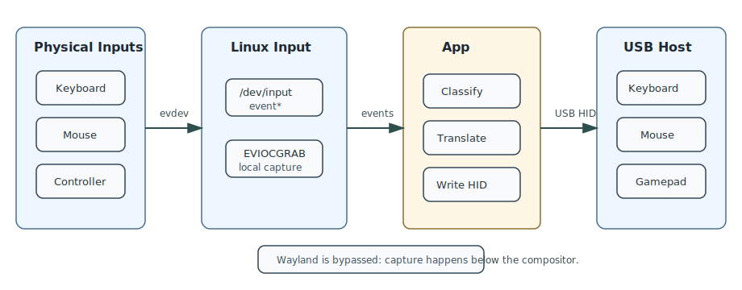

# Runtime, Verification, and Latency

This document covers the runtime assumptions and the practical checks to run on the Linux target.



## Hardware Checks

The machine running the app must have a USB controller that can operate in device/gadget mode.

Check for an available USB device controller:

```sh
ls /sys/class/udc
```

If this prints nothing, the running system cannot present itself as a USB keyboard, mouse, or controller through this software path.

Check that ConfigFS is mounted and USB gadget support is available:

```sh
ls /sys/kernel/config/usb_gadget
```

If the path is missing, ConfigFS may not be mounted or the kernel may not expose USB gadget support.

## Permissions And Process Model

The forwarding daemon needs access to:

```text
/dev/input/event*
/dev/hidg*
/sys/kernel/config/usb_gadget
```

The GTK frontend should run as the normal Steam user. It only talks to the daemon through:

```text
/run/steamdeckcontroller/control.sock
```

The daemon runs as root through systemd. This is required for USB gadget setup and evdev grabbing.

## Daemon Runtime Flow

Start capture from the GTK window. The frontend sends:

```text
START
```

The daemon then:

1. creates or reuses the ConfigFS gadget directory
2. writes device IDs, strings, configuration, HID descriptors, and report lengths
3. writes `interval = 1` for each HID function when the kernel exposes that attribute
4. links the HID functions into the active configuration
5. binds the gadget to the first UDC from `/sys/class/udc`
6. opens `/dev/hidg0`, `/dev/hidg1`, and `/dev/hidg2`
7. opens and grabs matching evdev input devices
8. forwards events until stopped

Stop capture from the GTK window. The frontend sends:

```text
STOP
```

The daemon can also stop from the local emergency chord:

```text
Ctrl+Shift+Esc
```

The emergency chord is consumed locally and stops forwarding.

The touchscreen usually remains usable because the current classifier does not grab absolute touch devices. On Steam Deck this provides a practical way to press Stop while keyboard, mouse, and controller events are grabbed and forwarded.

## Verifying USB Gadget State

After starting capture, inspect the gadget:

```sh
find /sys/kernel/config/usb_gadget/sdc_passthrough -maxdepth 3 -type f -o -type l
```

Check the HID function report lengths:

```sh
cat /sys/kernel/config/usb_gadget/sdc_passthrough/functions/hid.usb0/report_length
cat /sys/kernel/config/usb_gadget/sdc_passthrough/functions/hid.usb1/report_length
cat /sys/kernel/config/usb_gadget/sdc_passthrough/functions/hid.usb2/report_length
```

Expected:

```text
8
4
13
```

If your kernel exposes HID gadget polling intervals, check:

```sh
cat /sys/kernel/config/usb_gadget/sdc_passthrough/functions/hid.usb0/interval
cat /sys/kernel/config/usb_gadget/sdc_passthrough/functions/hid.usb1/interval
cat /sys/kernel/config/usb_gadget/sdc_passthrough/functions/hid.usb2/interval
```

Expected when supported:

```text
1
1
1
```

If the `interval` files do not exist, the app leaves the kernel defaults in place.

## Verifying From The Host

On a Linux host connected to the gadget port, use:

```sh
lsusb
cat /proc/bus/input/devices
```

The host should see a composite USB device with keyboard, mouse, and gamepad-like input interfaces.

For event-level inspection on the host:

```sh
sudo evtest
```

Select the new keyboard, mouse, or gamepad event node and verify that events arrive when using the physical devices attached to the proxy machine.

## Latency Model

The forwarding code itself is simple and should not be the dominant cost. The expected added latency is mainly:

```text
evdev wakeup/read              ~0.1-1 ms
translation/report packing     <0.1 ms
USB interrupt polling          ~1-8 ms, depending on interval and host behavior
host input stack/game frame     variable
```

The most important tuning point is the USB HID interrupt polling interval. When supported, the app requests interval `1` before binding the gadget.

The forwarding loop uses `poll(..., 100)`. This does not add 100 ms to active input events because `poll` wakes immediately when input arrives. The timeout only controls how quickly the thread notices a stop request while idle.

## Optimization Options

The most useful future optimizations are:

1. Batch evdev changes until `EV_SYN/SYN_REPORT`, then emit one HID report per logical input frame.
2. Verify that the host accepted a 1 ms polling interval.
3. Prebuild the `pollfd` array instead of rebuilding it each loop.
4. Handle `/dev/hidg*` nonblocking write errors and short writes explicitly.
5. Consider a real-time scheduling option for the forwarding thread.
6. Consider `mlockall` to avoid page fault stalls during capture.
7. Split the privileged forwarding path from the GTK UI.

Batching on `EV_SYN` is especially relevant for controller sticks, because X and Y axis events often arrive next to each other and currently produce separate reports.

## Failure Modes

`No USB device controller found in /sys/class/udc.`

The hardware or kernel does not expose a USB gadget-capable controller.

`Cannot open /dev/hidgN`

The gadget did not bind correctly, permissions are insufficient, or the expected HID gadget device node was not created.

No local keyboard/mouse input while running.

This is expected for grabbed devices. Use `Ctrl+Shift+Esc`, another non-grabbed input path, or SSH to recover.

Host sees keyboard/mouse but not an Xbox controller.

The current controller is Xbox-style HID, not true XInput. Some hosts/games may classify it as a HID gamepad rather than an Xbox controller.
